# User Flow

## Screen 1 - Sign up

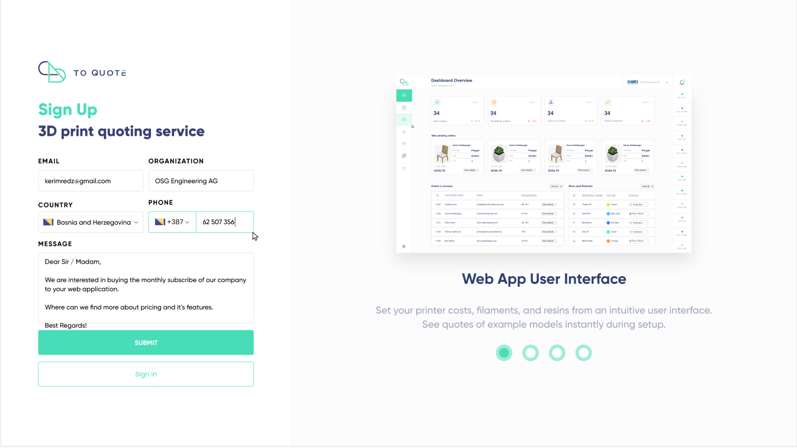
- [Get countries](./1.1-Managed-Data.md#get-countries)
- [Create request](./1.2.1-Client-data-General.md#create-request)

## Screen 2 - Set up wizard
- [Get organization's general info](./1.2.1-Client-data-General.md#get-organizations-general-info)
### Step 1 - Welcome
  Step in set up wizard
  `setup: general`
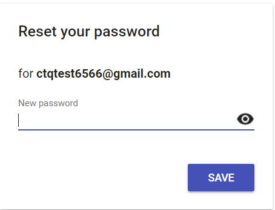

### Step 2 - General info
  Step in set up wizard
    `setup: general`
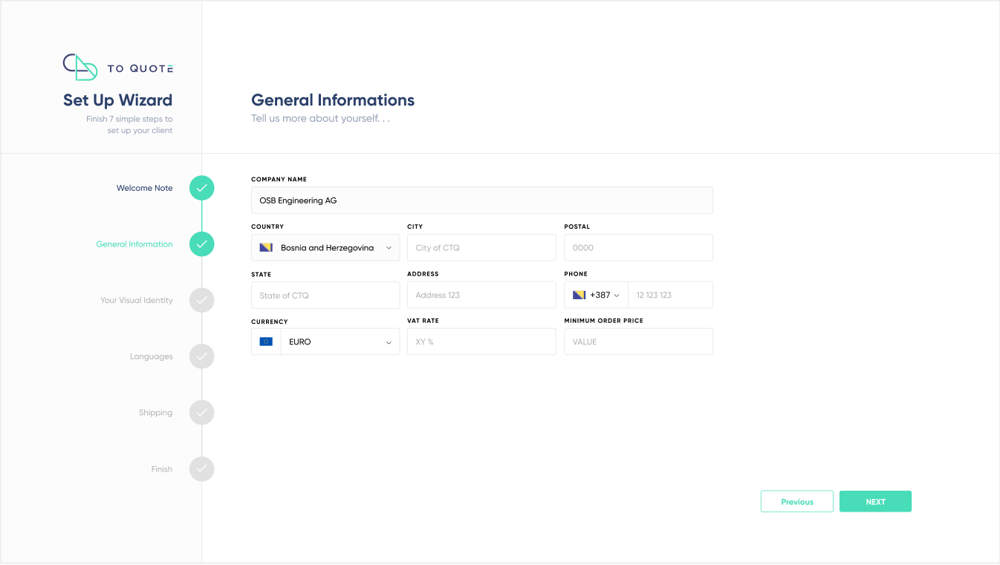
- [Get countries](./1.1-Managed-Data.md#get-countries)
- [Get currencies](./1.1-Managed-Data.md#get-currencies)
- [Add organization's general info](./1.2.1-Client-data-General.md#add-organizations-general-info)

### Step 3 - Visual settings
  Step in set up wizard
    `setup: visual`
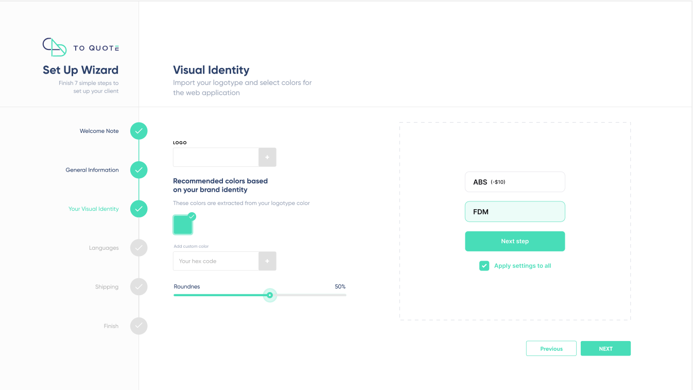
- [Add visual settings](./1.2.1-Client-data-General.md#add-visual-settings)

### Step 4 - Languages
  Step in set up wizard
    `setup: languages`
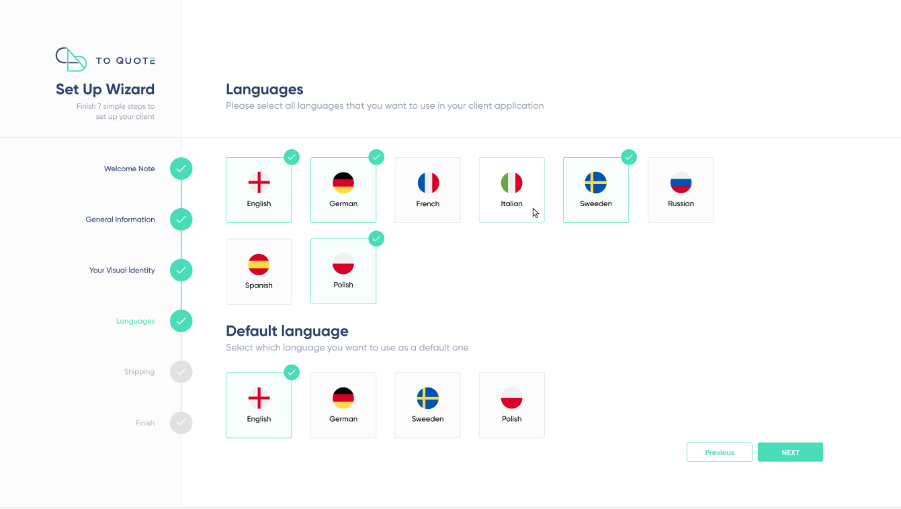
- [Get languages](./1.1-Managed-Data.md#get-languages)
- [Add languages](./1.2.1-Client-data-General.md#add-languages)

### Step 5 - Shipping
  Step in set up wizard
    `setup: shipping`
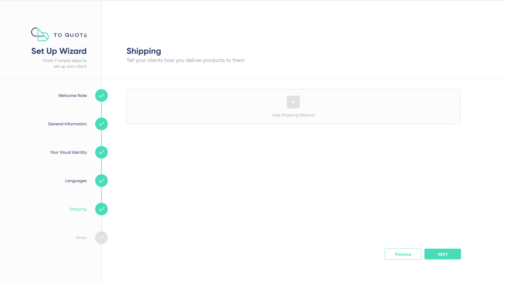

**Option 1 - Continue without shipping options**
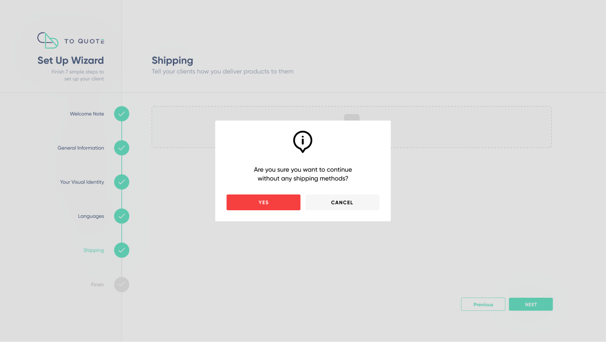

Call function `nextStep` to update step in the set up wizard
- [Next step](./1.2.1-Client-data-General.md#next-step)

**Option 2 - Add pickup option**
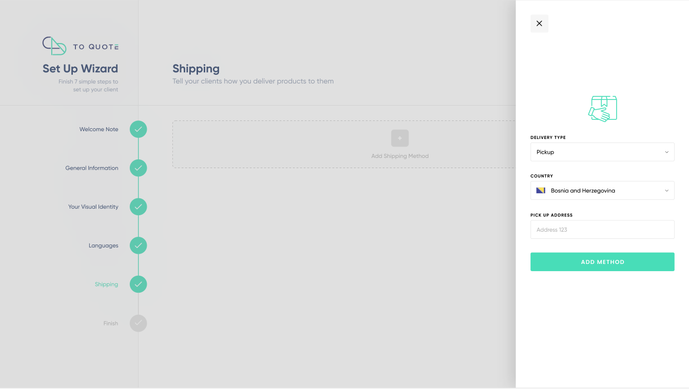
- [Add shipping option](./1.2.1-Client-data-General.md#data---type-pickup)

**Option 3 - Add delivery option**
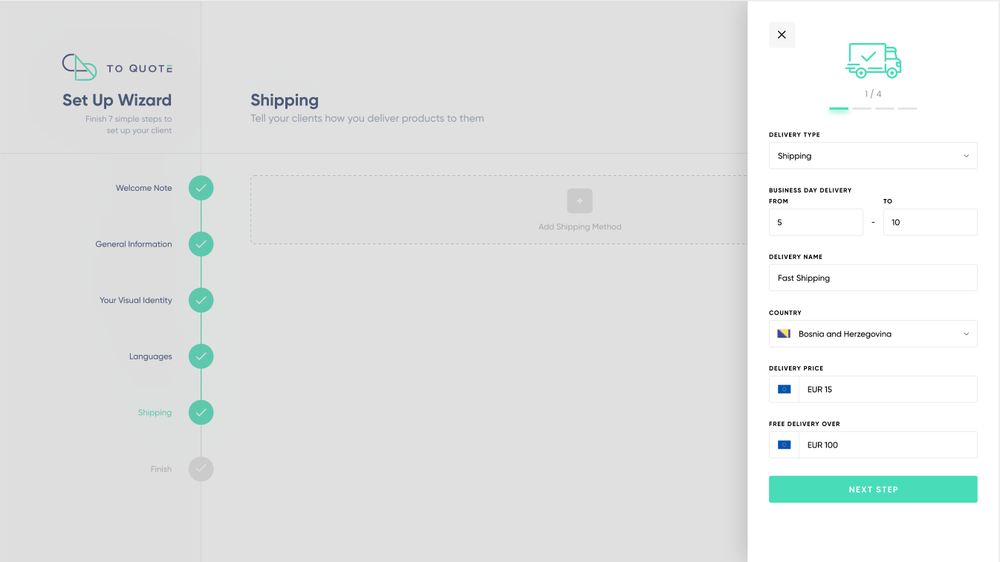
- [Add shipping option](./1.2.1-Client-data-General.md#data---type-delivery)

**Translations**
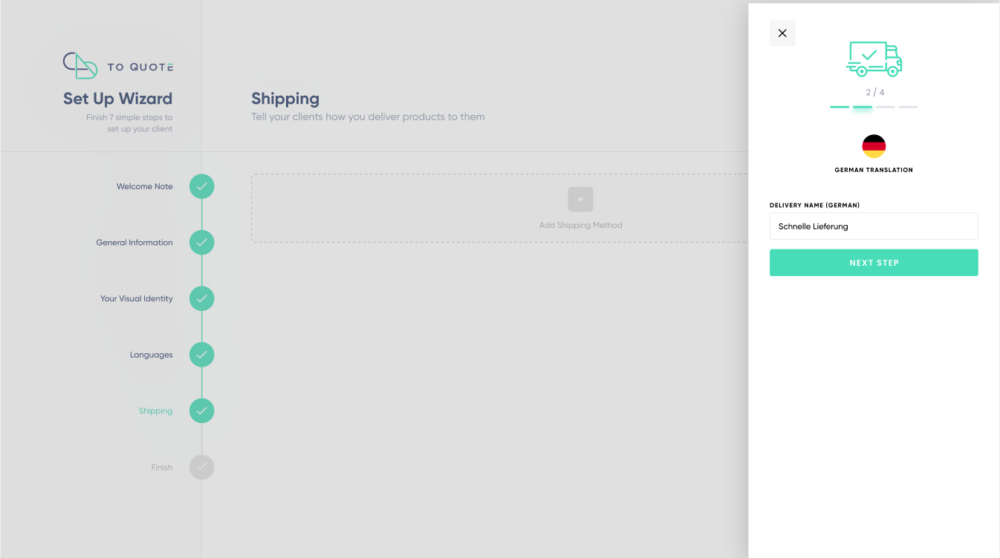
You can get organization's supported languages by calling the function [Get supported languages](./1.2.1-Client-data-General.md#get-supported-languages), or from organization's general info, if the data is previously fetched.

**Option 4 - Delete shipping option**
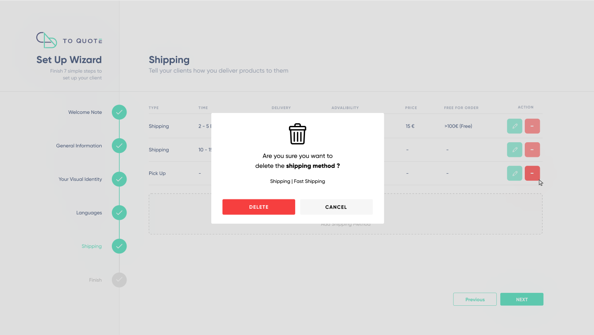
- [Delete shipping option](./1.2.1-Client-data-General.md#delete-shipping-option)

**Option 5 - Update shipping option**
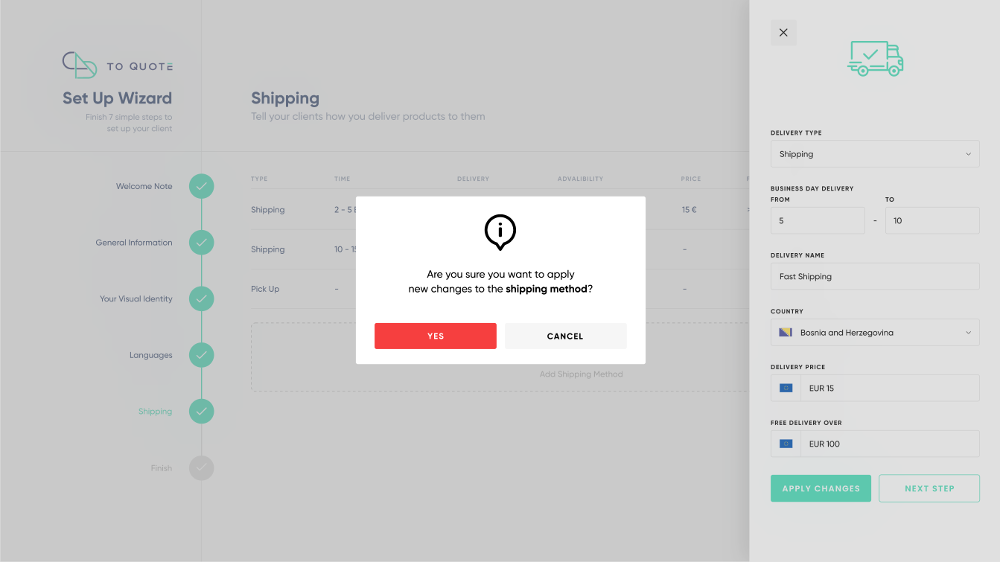
- [Get shipping options](./1.2.1-Client-data-General.md#get-shipping-options)
- [Update shipping option](./1.2.1-Client-data-General.md#update-shipping-option)

  **Note** - shipping type cannot be changed (from pickup to delivery and vice versa). 

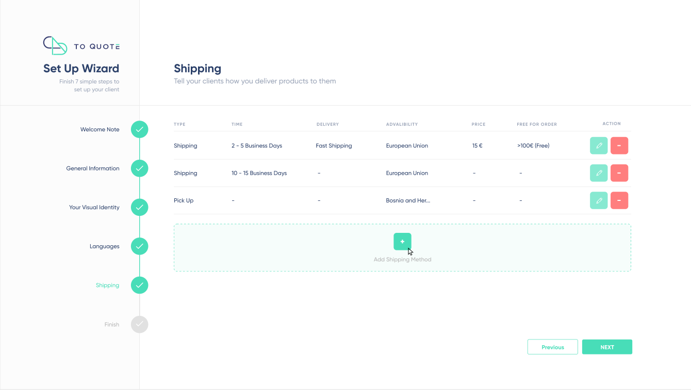
Call function `nextStep` to update step in the set up wizard

### Step 6 - Collaboration
  Step in set up wizard
    `setup: collaboration`
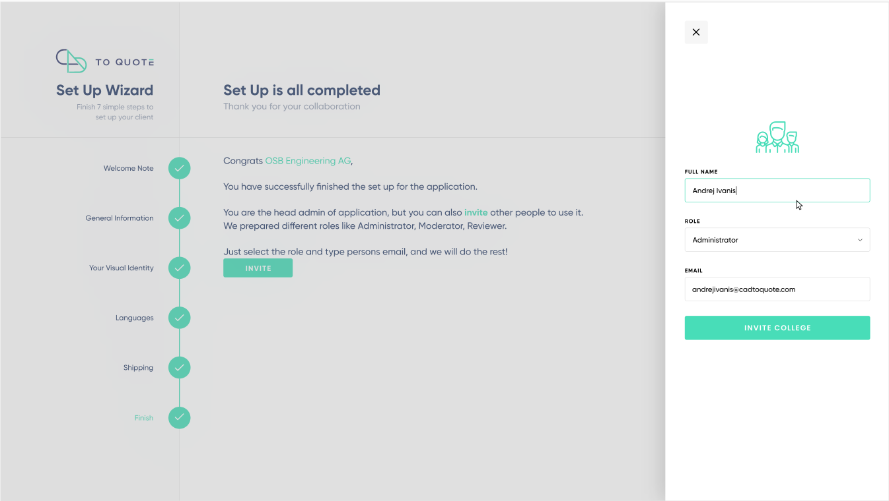

**To do**
- Add collaborator
- Get collaborators
- Update collaborator
- Delete collaborator

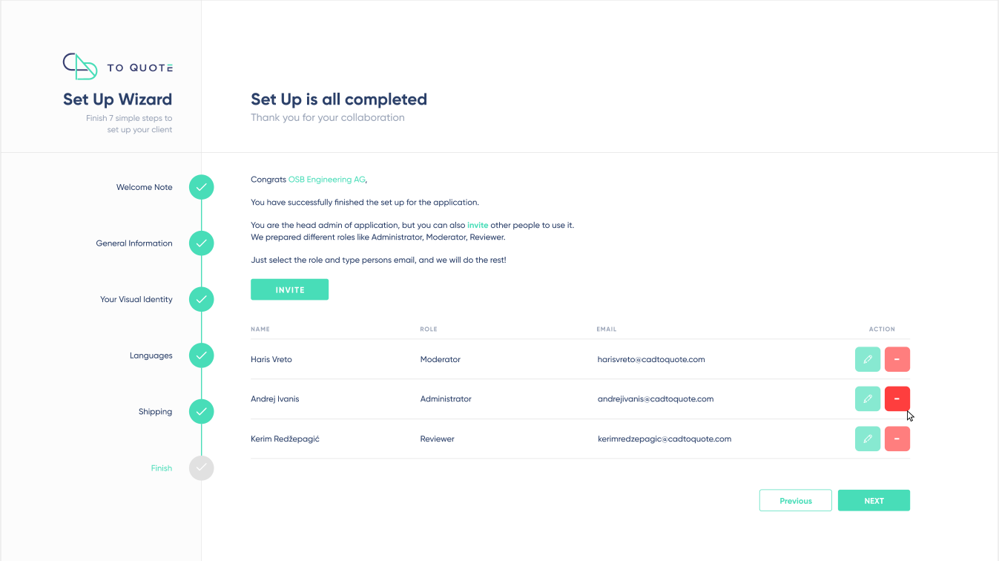
Call function `nextStep` to update step in the set up wizard

  Step in set up wizard
    `setup: finished`
